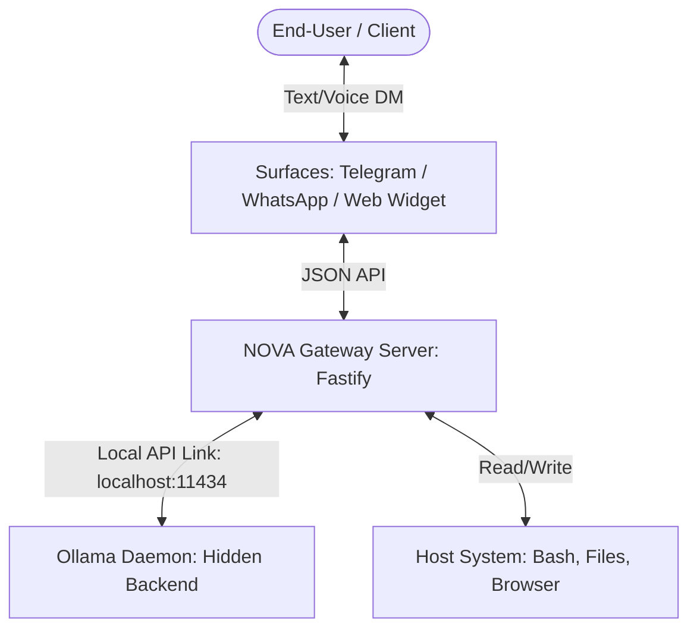

# NOVA — Deployment & Setup Guide

This guide explains how NOVA operates in the background (similar to OpenClaw) without exposing its AI engine (Ollama) to the end-user, and provides step-by-step setup instructions for every target environment.

---

## 1. How NOVA Works (Hidden Background Engine)

Just like OpenClaw, **Ollama runs silently in the background as a system service (daemon)**. The end-user never interacts with Ollama directly, nor do they see any CLI screens for it.



### Key Behaviors:
- **No Open Prompts**: Ollama acts exactly like a local database (like SQLite). It runs quietly on port `11434`.
- **Zero API Keys**: Since Ollama is local, the gateway doesn't make any external cloud calls. Everything is processed locally on the machine, preserving 100% data privacy.
- **Obedience Hook**: When a user messages Telegram, the Gateway intercepts the text, queries the local Ollama instance silently, processes the tool calls (runs bash, edits files), and returns only the final outcome back to the user.

---

## 2. Desktop Implementation (Tauri 2)

To run NOVA as a lightweight, native desktop application (15MB executable size instead of 150MB Electron wrapper), we wrap the web dashboard using **Tauri 2**.

### Step-by-Step Setup:
1. **Prerequisites**: Install Rust and the Tauri CLI tools:
   ```powershell
   # Install Rust compiler (required for Tauri builds)
   winget install Rust.RustUp
   ```
2. **Initialize Tauri wrapper in the workspace**:
   Create a new desktop directory `apps/desktop` inside the workspace:
   ```bash
   # Run Tauri initialization inside your workspace
   npx @tauri-apps/cli@next init --directory apps/desktop --app-title "NOVA Control" --window-title "NOVA Control Panel" --dist-dir "../../packages/gateway/public" --dev-path "http://localhost:3000"
   ```
3. **Configure Tauri 2**:
   Modify `apps/desktop/src-tauri/tauri.conf.json` to enable background system tray access and auto-start on boot:
   ```json
   {
     "bundle": {
       "active": true,
       "targets": ["msi", "nsis"]
     },
     "app": {
       "windows": [
         {
           "title": "NOVA Control Console",
           "width": 1024,
           "height": 768,
           "resizable": true
         }
       ]
     }
   }
   ```
4. **Compile & Distribute Desktop Binary**:
   Run the build script to compile a single `.exe` (Windows) or `.app` (macOS):
   ```bash
   # Build native app
   npx tauri build
   ```
   *The compiled installer will be located under `apps/desktop/src-tauri/target/release/bundle/`.*

---

## 3. Embedded System Setup (Raspberry Pi & ARM VMs)

For low-resource embedded boards or free ARM VMs (such as Oracle Cloud Free Tier), we configure NOVA to use a highly compressed model (`gemma3:2b` or `phi3:mini`) requiring less than 2GB of RAM.

### Step-by-Step Setup:
1. **Install Node.js & local LLM engine in one line**:
   ```bash
   # Install Ollama
   curl -fsSL https://ollama.ai/install.sh | sh

   # Install Node.js 22 LTS
   curl -fsSL https://deb.nodesource.com/setup_22.x | sudo -E bash -
   sudo apt-get install -y nodejs
   ```
2. **Download lightweight model**:
   ```bash
   ollama pull phi3:mini
   ```
3. **Deploy NOVA Workspace**:
   Clone the repository to the embedded system:
   ```bash
   git clone https://github.com/MithunVimalan/NOVA.ai.git
   cd NOVA.ai
   npm install -g pnpm
   pnpm install
   pnpm run build
   ```
4. **Daemonize NOVA with PM2 (Runs 24/7 in Background)**:
   ```bash
   sudo npm install -g pm2
   pm2 start packages/gateway/dist/server.js --name "nova-gateway"
   pm2 save
   pm2 startup
   ```
   *NOVA is now running silently as a background service on the embedded computer.*

---

## 4. WhatsApp Channel Connection (Baileys Web Bridge)

NOVA uses a free, open-source WhatsApp Web protocol bridge. This means **no Meta Business API account or paid templates are required**.

### Step-by-Step Setup:
1. **Enable the WhatsApp Channel**:
   Open config file `~/.nova/nova.json` and set `whatsapp.enabled` to `true`:
   ```json
   "channels": {
     "whatsapp": {
       "enabled": true
     }
   }
   ```
2. **Launch the Gateway**:
   ```bash
   pnpm --filter @nova/gateway run start
   ```
3. **Scan QR Code**:
   - The terminal console will print a QR code on startup.
   - Open WhatsApp on your mobile phone, navigate to **Linked Devices > Link a Device**, and scan the terminal QR code.
4. **Obey User Commands**:
   - Send any text message to your linked number from another contact (or self-chat).
   - NOVA intercepts it, executes the task, and sends the response back to your WhatsApp chat window.

---

## 5. Telegram Channel Connection (@BotFather)

### Step-by-Step Setup:
1. **Create Bot on Telegram**:
   - Open Telegram and search for `@BotFather`.
   - Send the `/newbot` command.
   - Choose a name and a unique username for your bot.
   - Copy the generated HTTP API Token (looks like `123456789:ABCdefGhIJKlmNoPQRsTUVwxyZ`).
2. **Inject Token into Configurations**:
   Open config file `~/.nova/nova.json` and configure the token:
   ```json
   "channels": {
     "telegram": {
       "enabled": true,
       "token": "YOUR_API_TOKEN_HERE"
     }
   }
   ```
3. **Start the Bot**:
   Launch the gateway. It will automatically connect to Telegram:
   ```bash
   pnpm --filter @nova/gateway run start
   ```
4. **Register Owner Account**:
   - Search for your bot username on Telegram and click **Start** (or send `/start`).
   - The bot records your Telegram account ID as the system owner.
   - You can now type task requests (e.g., `"run dir C:\"` or `"create file list.txt"`) directly in the Telegram DM, and NOVA will execute them.
